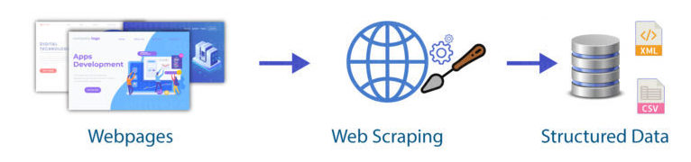

# Web Scraping with Python
> Simple web scraping presentation created in Python

## Table of contents
* [Introduction](#introduction)
* [Workflow](#workflow)
* [Requirements](#requirements)
* [Usage](#usage)
* [Contact](#contact)

## Introduction
This project is aimed to extract restaurant data from [Thuisbezorgd.nl](https://www.thuisbezorgd.nl/en/)
with python and the two main libraries: Selenium and BeautifulSoup.

## Workflow

## Requirements
* BeautifulSoup
* json
* numpy
* os
* pandas
* python 3.6+
* selenium
* sqlalchemy
* sys
* termcolor
* time
* webdriver_manager

Please note that in addition to the list of libraries mentioned above, you 
will still need a browser driver to simulate browser sessions. In this project
I use [ChromeDriver](https://chromedriver.chromium.org/downloads). However, 
with webdriver_manager, you do not need to explicitly download binary 
[ChromeDriver](https://chromedriver.chromium.org/downloads), unzip it somewhere 
in your PC, and set path to it. The webdriver_manager module will take care of 
everything for you!

## Usage
Run [thuisbezorgd.py](./thuisbezorgd.py) and follow the instructions shown in the Python console.

## Contact
Created by [Jeff Chen](mailto:jeff73511@msn.com) - feel free to contact me!

